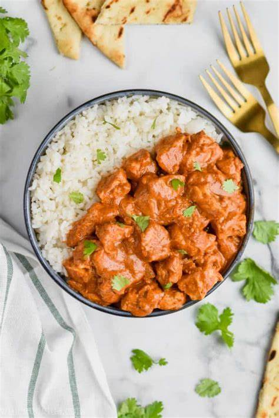
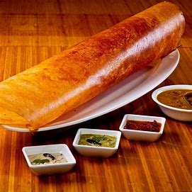
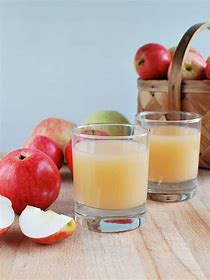
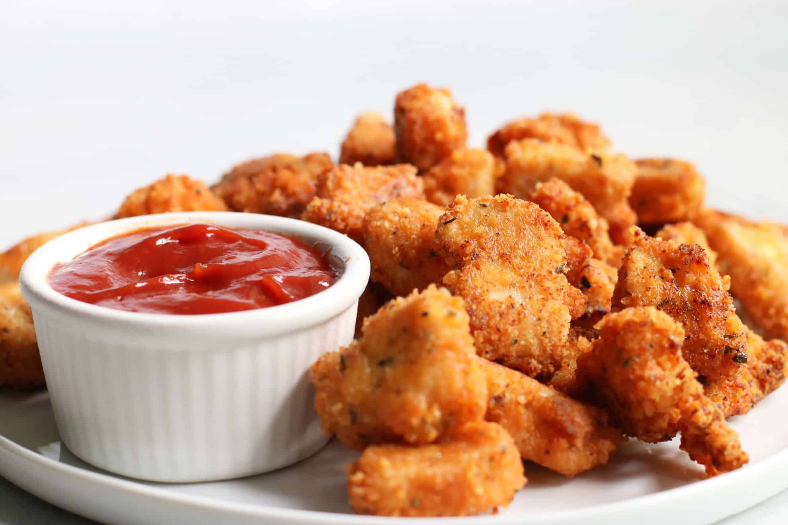
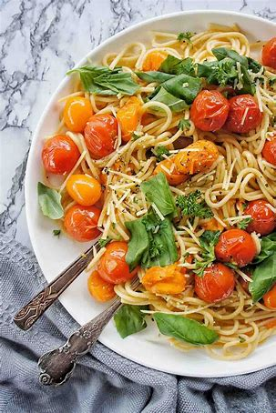
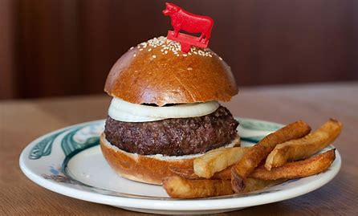

# Ex.07 Restaurant Website
## Date:16-12-2024

## AIM:
To develop a static Restaurant website to display the food items and services provided by them.

## DESIGN STEPS:

### Step 1:
Requirement collection.

### Step 2:
Creating the layout using HTML and CSS.

### Step 3:
Updating the sample content.

### Step 4:
Choose the appropriate style and color scheme.

### Step 5:
Validate the layout in various browsers.

### Step 6:
Validate the HTML code.

### Step 7:
Publish the website in the given URL.

## PROGRAM:
```
home.html
<!DOCTYPE html>
<html lang="en">

<head>
    <meta charset="UTF-8">
    <meta name="viewport" content="width=device-width, initial-scale=1.0">
    <title>Rovarsinn restaurant</title>
    <link rel="stylesheet" href="style.css">
    <link rel="stylesheet" href="https://cdnjs.cloudflare.com/ajax/libs/font-awesome/6.1.1/css/all.min.css"
        integrity="sha512-KfkfwYDsLkIlwQp6LFnl8zNdLGxu9YAA1QvwINks4PhcElQSvqcyVLLD9aMhXd13uQjoXtEKNosOWaZqXgel0g=="
        crossorigin="anonymous" referrerpolicy="no-referrer">

    <link rel="preconnect" href="https://fonts.googleapis.com">
    <link rel="preconnect" href="https://fonts.gstatic.com" crossorigin>
    <link
        href="https://fonts.googleapis.com/css2?family=Bebas+Neue&family=Caveat:wght@400..700&family=Dancing+Script:wght@400..700&family=Lobster&family=Orbitron:wght@400..900&family=Permanent+Marker&family=Sour+Gummy:ital,wght@0,100..900;1,100..900&display=swap"
        rel="stylesheet">
    <link rel="preconnect" href="https://fonts.googleapis.com">
    <link rel="preconnect" href="https://fonts.gstatic.com" crossorigin>
    <link
        href="https://fonts.googleapis.com/css2?family=Bebas+Neue&family=Caveat:wght@400..700&family=Dancing+Script:wght@400..700&family=Lobster&family=Orbitron:wght@400..900&family=Oswald:wght@200..700&family=Permanent+Marker&family=Sour+Gummy:ital,wght@0,100..900;1,100..900&display=swap"
        rel="stylesheet">
    <link rel="preconnect" href="https://fonts.googleapis.com">
    <link rel="preconnect" href="https://fonts.gstatic.com" crossorigin>
    <link
        href="https://fonts.googleapis.com/css2?family=Bebas+Neue&family=Caveat:wght@400..700&family=Dancing+Script:wght@400..700&family=Lobster&family=Nunito:ital,wght@0,200..1000;1,200..1000&family=Orbitron:wght@400..900&family=Oswald&family=Permanent+Marker&family=Sour+Gummy:ital,wght@0,100..900;1,100..900&display=swap"
        rel="stylesheet">
</head>

<body>
    <nav>
        <div class="links">
            <ul>
                <li><a href="home.html">Home</a></li>
                <li><a href="about.html">About</a></li>
                <li><a href="admin.html">Administration</a></li>
                <li><a href="menu.html">Menu</a></li>
                <li><a href="contact.html">Book Now</a></li>
            </ul>
        </div>
    </nav>
    <div class="main">
        <div class="text">
            <h1>GET <span>HOMELY FOODS </span>IN SECONDS</h1>
        </div>
        <div class="homeimg">
            
        </div>
    </div>
    <div class="btn">
        <a href="contact.html" class="order_btn">BOOK NOW</a>
    </div>
    <footer>
        Designed with <i class="fa-regular fa-heart"></i> by ASIN RENIX V &copy;
    </footer>
</body>
</html>
about.html
<!DOCTYPE html>
<html lang="en">

<head>
    <meta charset="UTF-8">
    <meta name="viewport" content="width=device-width, initial-scale=1.0">
    <title>About Us ~ Rovarsinn restaurant</title>
    <link rel="stylesheet" href="style.css">
    <link rel="stylesheet" href="https://cdnjs.cloudflare.com/ajax/libs/font-awesome/6.1.1/css/all.min.css" integrity="sha512-KfkfwYDsLkIlwQp6LFnl8zNdLGxu9YAA1QvwINks4PhcElQSvqcyVLLD9aMhXd13uQjoXtEKNosOWaZqXgel0g==" crossorigin="anonymous" referrerpolicy="no-referrer">

    <link rel="preconnect" href="https://fonts.googleapis.com">
    <link rel="preconnect" href="https://fonts.gstatic.com" crossorigin>
    <link
        href="https://fonts.googleapis.com/css2?family=Bebas+Neue&family=Caveat:wght@400..700&family=Dancing+Script:wght@400..700&family=Lobster&family=Orbitron:wght@400..900&family=Permanent+Marker&family=Sour+Gummy:ital,wght@0,100..900;1,100..900&display=swap"
        rel="stylesheet">
    <link rel="preconnect" href="https://fonts.googleapis.com">
    <link rel="preconnect" href="https://fonts.gstatic.com" crossorigin>
    <link
        href="https://fonts.googleapis.com/css2?family=Bebas+Neue&family=Caveat:wght@400..700&family=Dancing+Script:wght@400..700&family=Lobster&family=Orbitron:wght@400..900&family=Oswald:wght@200..700&family=Permanent+Marker&family=Sour+Gummy:ital,wght@0,100..900;1,100..900&display=swap"
        rel="stylesheet">
    <link rel="preconnect" href="https://fonts.googleapis.com">
    <link rel="preconnect" href="https://fonts.gstatic.com" crossorigin>
    <link
        href="https://fonts.googleapis.com/css2?family=Bebas+Neue&family=Caveat:wght@400..700&family=Dancing+Script:wght@400..700&family=Lobster&family=Nunito:ital,wght@0,200..1000;1,200..1000&family=Orbitron:wght@400..900&family=Oswald&family=Permanent+Marker&family=Sour+Gummy:ital,wght@0,100..900;1,100..900&display=swap"
        rel="stylesheet">

</head>
<body>
    <nav>
        </div>
        <div class="links1">
            <ul>
                <li><a href="home.html">Home</a></li>
                <li><a href="about.html">About</a></li>
                <li><a href="admin.html">Administration</a></li>
                <li><a href="menu.html">Menu</a></li>
                <li><a href="contact.html">Book Now</a></li>
            </ul>
        </div>
    </nav>
    <div class="h1">
        <h1><span class="abt">ABOUT </span>US </h1></div>
    <div class="about">
        
        <div class="abt1">
            <h2>Why Us!?</h2>
            <p>Rovarsinn restaurant is a unique culinary destination that offers a diverse range of dining experiences. From the comfort of home-style Indian cuisine to the exotic flavors of international dishes, there's something for everyone. The restaurant boasts a separate section dedicated to authentic Indian delicacies, served in traditional style with a focus on regional specialties. For those seeking quick bites, the fast-food section offers a variety of tempting options. The presence of a world-class chef ensures that every dish is a masterpiece, elevating the dining experience without breaking the bank. Beyond the food, Rovarsinn restaurant provides a fun and relaxing atmosphere with games and chill zones, making it a perfect spot for families and friends to unwind.
            </p>
        </div>

        <div class="abtimg">
            
        </div>
        <p></p>
    </div>
    <footer class="abtfo">
        Designed with  <i class="fa-regular fa-heart"></i> by ASIN RENIX V &copy;
    </footer>
</body>
</html>

admin.html

<!DOCTYPE html>
<html lang="en">

<head>
    <meta charset="UTF-8">
    <meta name="viewport" content="width=device-width, initial-scale=1.0">
    <title>Administration ~ Rovarsinn restaurant</title>
    <link rel="stylesheet" href="style.css">
    <link rel="stylesheet" href="https://cdnjs.cloudflare.com/ajax/libs/font-awesome/6.1.1/css/all.min.css"
        integrity="sha512-KfkfwYDsLkIlwQp6LFnl8zNdLGxu9YAA1QvwINks4PhcElQSvqcyVLLD9aMhXd13uQjoXtEKNosOWaZqXgel0g=="
        crossorigin="anonymous" referrerpolicy="no-referrer">

    <link rel="preconnect" href="https://fonts.googleapis.com">
    <link rel="preconnect" href="https://fonts.gstatic.com" crossorigin>
    <link href="https://fonts.googleapis.com/css2?family=Bebas+Neue&family=Caveat:wght@400..700&family=Dancing+Script:wght@400..700&family=Lobster&family=Orbitron:wght@400..900&family=Permanent+Marker&family=Sour+Gummy:ital,wght@0,100..900;1,100..900&display=swap" rel="stylesheet">
    <link href="https://fonts.googleapis.com/css2?family=Bebas+Neue&family=Caveat:wght@400..700&family=Dancing+Script:wght@400..700&family=Lobster&family=Orbitron:wght@400..900&family=Oswald:wght@200..700&family=Permanent+Marker&family=Sour+Gummy:ital,wght@0,100..900;1,100..900&display=swap" rel="stylesheet">
    <link href="https://fonts.googleapis.com/css2?family=Bebas+Neue&family=Caveat:wght@400..700&family=Dancing+Script:wght@400..700&family=Lobster&family=Nunito:ital,wght@0,200..1000;1,200..1000&family=Orbitron:wght@400..900&family=Oswald&family=Permanent+Marker&family=Sour+Gummy:ital,wght@0,100..900;1,100..900&display=swap" rel="stylesheet">

</head>

<body>
    <nav>
        </div>
        <div class="links">
            <ul>
                <li><a href="home.html">Home</a></li>
                <li><a href="about.html">About</a></li>
                <li><a href="admin.html">Administration</a></li>
                <li><a href="menu.html">Menu</a></li>
                <li><a href="contact.html">Book now</a></li>
            </ul>
        </div>
    </nav>
    <div class="chefad">
        <div class="team">
            <h1>Meet <span>Our Team!!!</span></h1>

            <div class="admin">
                <div class="admins">
                    <div class="admininfo">
                        <div class="imgad">
                            
                        </div>
                        <h3>THALAPATHY VIJAY</h3>
                    </div>
                    </div>    
                            <div class="admins">
                                <div class="admininfo">
                                    <div class="imgad">
                                        
                                        </div>
                                        <h3>AJITH</h3>
                                    </div>
                                </div>
                            </div>
                        </div>
        <div class="chef">
            
            <div class="chefs">
                
                <h1>Chef Damu</h1>
            </div>

            <div class="chefs">
                
                <h1>Chef Venkatesh Bhat</h1>
            </div>
        </div>
    </div>
    <footer class="admf">
        Designed with <i class="fa-regular fa-heart"></i> by ASIN RENIX V &copy;
    </footer>
</body>

</html>

menu.html


<!DOCTYPE html>
<html lang="en">

<head>
    <meta charset="UTF-8">
    <meta name="viewport" content="width=device-width, initial-scale=1.0">
    <title>Rovarsinn restaurant</title>
    <link rel="stylesheet" href="style.css">
    <link rel="stylesheet" href="https://cdnjs.cloudflare.com/ajax/libs/font-awesome/6.1.1/css/all.min.css"
        integrity="sha512-KfkfwYDsLkIlwQp6LFnl8zNdLGxu9YAA1QvwINks4PhcElQSvqcyVLLD9aMhXd13uQjoXtEKNosOWaZqXgel0g=="
        crossorigin="anonymous" referrerpolicy="no-referrer">

    <link rel="preconnect" href="https://fonts.googleapis.com">
    <link rel="preconnect" href="https://fonts.gstatic.com" crossorigin>
    <link
        href="https://fonts.googleapis.com/css2?family=Bebas+Neue&family=Caveat:wght@400..700&family=Dancing+Script:wght@400..700&family=Lobster&family=Orbitron:wght@400..900&family=Permanent+Marker&family=Sour+Gummy:ital,wght@0,100..900;1,100..900&display=swap"
        rel="stylesheet">
    <link
        href="https://fonts.googleapis.com/css2?family=Bebas+Neue&family=Caveat:wght@400..700&family=Dancing+Script:wght@400..700&family=Lobster&family=Orbitron:wght@400..900&family=Oswald:wght@200..700&family=Permanent+Marker&family=Sour+Gummy:ital,wght@0,100..900;1,100..900&display=swap"
        rel="stylesheet">
    <link
        href="https://fonts.googleapis.com/css2?family=Bebas+Neue&family=Caveat:wght@400..700&family=Dancing+Script:wght@400..700&family=Lobster&family=Nunito:ital,wght@0,200..1000;1,200..1000&family=Orbitron:wght@400..900&family=Oswald&family=Permanent+Marker&family=Sour+Gummy:ital,wght@0,100..900;1,100..900&display=swap"
        rel="stylesheet">
</head>

<body>

    <nav>
        
        <div class="links">
            <ul>
                <li><a href="home.html">Home</a></li>
                <li><a href="about.html">About</a></li>
                <li><a href="admin.html">Administration</a></li>
                <li><a href="menu.html">Menu</a></li>
                <li><a href="contact.html">Book Now</a></li>
            </ul>
        </div>
    </nav>
    <div class="menubar">
        <h1>Delicious Food!</h1>
        <div class="indian">
            
            <div class="ind">
                
                <h2>BUTTER CHICKEN - ₹200</h2>
                <p>"Indulge in a symphony of flavors with our diverse Butter chicken selection."</p>
            </div>
            <div class="ind">
                
                <h2>Mini South Indian Tiffin - ₹100</h2>
                <p>"A mini feast of South Indian flavors."</p>
            </div>
            <div class="ind">
                
                <h2>CHEESE BURGER- ₹175</h2>
                <P>"Experience the magic of Cheese burger, our way."</P>
            </div>
            <div class="ind">
                
                <div class="view">
                
                <h3>View All</h3>
                </div>
                
            </div>
        </div>
        <h1>Fast foods</h1>
        <div class="fast">
            <div class="fastt">
                
                <h2>Burger - ₹90</h2>
                <p>"Discover a burger for every craving."</p>
            </div>
            <div class="fastt">
                
                <h2>NUGGETS - ₹90</h2>
                <p>"Elevate your fry game with our unique flavors."</p>
            </div>
            <div class="fastt">
                
                <h2>COCKTAILS - ₹120</h2>
                <p>"A slice of heaven, every time."</p>
            </div>
            <div class="fastt">
                <div class="view">
                
                
                <h3>View All</h3></div>
            </div>
        </div>
        <h1>Yummyyy!!!</h1>
        <div class="other">
            <div class="otherr">
                
                <h2>MOCHA FROSTING - ₹250</h2>
                <p>"Take your way to flavor town."</p>
            </div>
            <div class="otherr">
                
                <h2>PASTA - ₹275</h2>
                <p>"Pastry paradise."</p>
            </div>
            <div class="otherr">
                
                <h2>SPICY CHICKEN - ₹300</h2>
                <p>"Shrimply delicious."</p>
            </div>
            <div class="otherr">
                <div class="view">
                
                <h3>View All</h3>
                </div>
            </div>
        </div>
    </div>

    <footer>
        Designed with <i class="fa-regular fa-heart"></i> by ASIN RENIX V &copy;
    </footer>
</body>
</html>

contact.html


<!DOCTYPE html>
<html lang="en">

<head>
    <meta charset="UTF-8">
    <meta name="viewport" content="width=device-width, initial-scale=1.0">
    <title>About Us ~ Rovarsinn restaurant</title>
    <link rel="stylesheet" href="style.css">
    <link rel="stylesheet" href="https://cdnjs.cloudflare.com/ajax/libs/font-awesome/6.1.1/css/all.min.css" integrity="sha512-KfkfwYDsLkIlwQp6LFnl8zNdLGxu9YAA1QvwINks4PhcElQSvqcyVLLD9aMhXd13uQjoXtEKNosOWaZqXgel0g==" crossorigin="anonymous" referrerpolicy="no-referrer">

    <link rel="preconnect" href="https://fonts.googleapis.com">
    <link rel="preconnect" href="https://fonts.gstatic.com" crossorigin>
    <link
        href="https://fonts.googleapis.com/css2?family=Bebas+Neue&family=Caveat:wght@400..700&family=Dancing+Script:wght@400..700&family=Lobster&family=Orbitron:wght@400..900&family=Permanent+Marker&family=Sour+Gummy:ital,wght@0,100..900;1,100..900&display=swap"
        rel="stylesheet">
    <link rel="preconnect" href="https://fonts.googleapis.com">
    <link rel="preconnect" href="https://fonts.gstatic.com" crossorigin>
    <link
        href="https://fonts.googleapis.com/css2?family=Bebas+Neue&family=Caveat:wght@400..700&family=Dancing+Script:wght@400..700&family=Lobster&family=Orbitron:wght@400..900&family=Oswald:wght@200..700&family=Permanent+Marker&family=Sour+Gummy:ital,wght@0,100..900;1,100..900&display=swap"
        rel="stylesheet">
    <link rel="preconnect" href="https://fonts.googleapis.com">
    <link rel="preconnect" href="https://fonts.gstatic.com" crossorigin>
    <link
        href="https://fonts.googleapis.com/css2?family=Bebas+Neue&family=Caveat:wght@400..700&family=Dancing+Script:wght@400..700&family=Lobster&family=Nunito:ital,wght@0,200..1000;1,200..1000&family=Orbitron:wght@400..900&family=Oswald&family=Permanent+Marker&family=Sour+Gummy:ital,wght@0,100..900;1,100..900&display=swap"
        rel="stylesheet">

</head>

<body>

    <nav>
        </div>
        <div class="links">
            <ul>
                <li><a href="home.html">Home</a></li>
                <li><a href="about.html">About</a></li>
                <li><a href="admin.html">Administration</a></li>
                <li><a href="menu.html">Menu</a></li>
                <li><a href="contact.html">Book Now</a></li>
            </ul>
        </div>
    </nav>
    <div class="book">
        
        <div class="bookimg">
            <h1><span>Order</span> Now</h1>
            <div class="bimg">
            </div>
        </div>
        <div class="order">
            <form>
                <div class="inp">
                    <label> Enter Your Name:</label><br>
                    <input type="text" minlength="3" placeholder="Enter Name" required>
                </div>
                <div class="inp">
                    <label> Enter Your Mobile Number:</label><br>
                    <input type="text" minlength="10" maxlength="10" placeholder="Enter Mobile No." required>
                </div>
                <div class="inp">
                    <label> Enter Your Email:</label><br>
                    <input type="email" placeholder="Enter email">
                </div>
                <div class="inp">
                    <label> Enter tables to be booked:</label><br>
                    <input type="number" placeholder="Enter no. of tables" required>
                </div>
                <div class="inp">
                    <label>Select Date</label><br>
                    <select name="Date" required>
                        <option value="16-12-2024">16-12-2024</option>
                        <option value="17-12-2024">17-12-2024</option>
                        <option value="18-12-2024">18-12-2024</option>
                        <option value="19-12-2024">19-12-2024</option>
                        <option value="20-12-2024">20-12-2024</option>
                    </select>
                </div>
                <div class="inp">
                    <label>Select Time</label><br>
                    <select name="Date" required>
                        <option value="1PM">1PM</option>
                        <option value="2PM">2PM</option>
                        <option value="3PM">3PM</option>
                        <option value="7PM">7PM</option>
                        <option value="9PM">9PM</option>
                    </select>
                </div>
                <div class="sub">
                <input type="submit" class ="submit" value="Book">
                    </div>

            </form>
        </div>
    </div>

    <footer class="conf">
        Designed with <i class="fa-regular fa-heart"></i> by ASIN RENIX V &copy;
    </footer>
</body>
</html>
```

## OUTPUT:

.png>)
.png>)
.png>)
.png>)
.png>)
.png>)
.png>)
.png>)

## RESULT:
The program for designing software company website using HTML and CSS is completed successfully.
